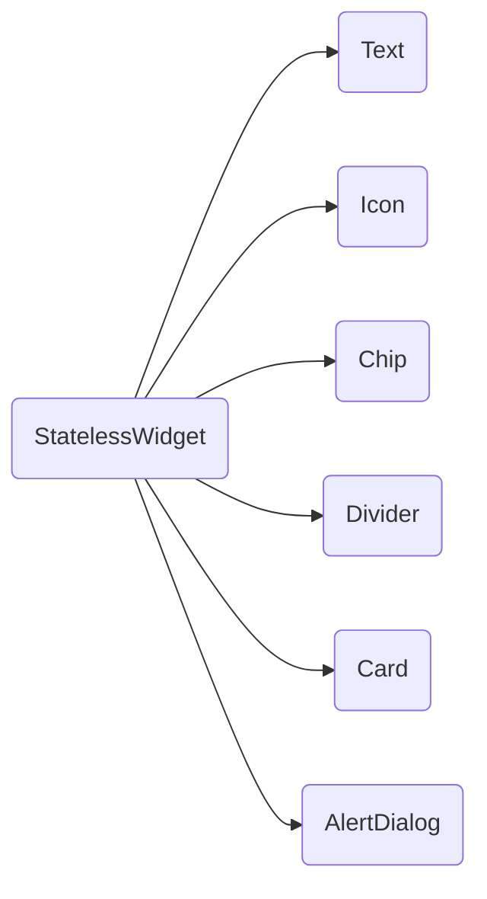
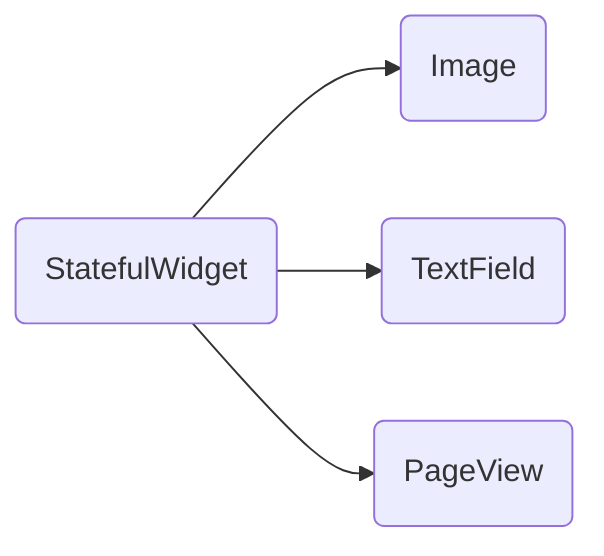

# StatelessWidget & StatefulWidget

## [StatelessWidget](https://api.flutter.dev/flutter/widgets/StatelessWidget-class.html)

一个不需要可变 state 的 Widget

- 没有状态，它们只会被渲染一次并且不会自我更新

> android studio 中输入 `stless` 可快速创建一个 StatelessWidget

## [StatefulWidget](https://api.flutter.dev/flutter/widgets/StatefulWidget-class.html)

一个拥有可变 state 的 Widget

- 有一个 `setState` 方法，用于更新 state

> android studio 中输入 `stful` 可快速创建一个 StatefulWidget

## 两者区别

1. 能否**自我重新构建**(***self rebuild***)

2. 性能消耗

**`StatelessWidget` 相较于 `StatefulWidget` 性能消耗更小**

每次**Build**都需要新建和销毁大量的**Widget**，**Element Tree**的**diff**，甚至繁重的渲染和重绘。所以推出 **StatelessWidget** 就是为了性能的考虑而对开发者进行的一些约束

## StatelessWidget 类常用组件

## StatefulWidget 类常用组件

