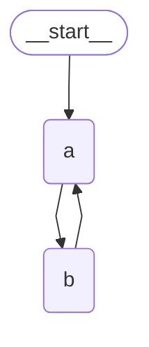

# 状态  节点  边


## 图（Graph）

LangGraph 将代理工作流建模为图。你可以使用三个关键组件来定义代理的行为：

1. 状态（`State`）：一种共享的数据结构，代表应用程序的当前快照。它可以是任何 Python 类型，但通常是 `TypedDict` 或 Pydantic 的 `BaseModel`。
2. 节点（`Nodes`）：编码代理逻辑的 Python 函数。它们接收当前的 `State` 作为输入，执行一些计算或副作用操作，并返回更新后的 `State`。
3. 边（`Edges`）：根据当前的 `State` 确定接下来要执行哪个 `Node` 的 Python 函数。它们可以是条件分支或固定的转换。

*简而言之：节点负责执行工作。边指示下一步要做什么*。

## 状态图（StateGraph）

`StateGraph` 类是主要使用的图类。它由用户定义的 `State` 对象进行参数化。

```python
from typing import TypedDict
from langgraph.graph import StateGraph

# 定义状态
class State(TypedDict):
  foo: str

# 参数化
graph_builder = StateGraph(State)
```

## 编译图

步骤

1. 创建状态图
2. 添加节点
3. 用边将节点连接
4. 编译

> 在使用图前必须编译图

```python
graph = graph_builder.add_node(xx).add_edge(START, "xx").compile()
```

## 状态-节点-边 简单例子

```python
from typing_extensions import Annotated, TypedDict
from langchain_core.messages import AnyMessage, AIMessage, HumanMessage
from langgraph.graph import StateGraph, START

# 自定义用户状态
class State(TypedDict):
  messages: Annotated[list[AnyMessage], add]

# 创建状态图
builder = StateGraph(State)

# 定义节点函数
def node(state: State):
  return { "messages": [AIMessage(content="你好，有什么可以帮助你吗？")] }

graph = 
	builder
  	.add_node(node) # 添加节点
    .add_edge(START, "node") # 用边将节点连接
    .compile() # 编译

# 使用图
result = graph.invoke({"messages": [HumanMessage(content="你好")]})
for message in result["messages"]:
  message.pretty_print()

# ================================ Human Message =================================
# 你好
# ================================== Ai Message ==================================
# 你好，有什么可以帮助你吗？
```

## 控制循环次数

在创建带有循环的图时，需要一种终止执行的机制

1. 最常见的做法是添加一条**条件边**，一旦达到某个终止条件，就将路径导向END节点

2. 可以**设置图的递归限制**，递归限制设置了图在抛出错误之前允许执行的超级步数量

   ```python
   graph.invoke(inputs, {"recursion_limit": 3})
   ```

*以下是设置图递归的例子：*



```python
from langgraph.graph import StateGraph, START, END
from langgraph.graph.message import MessagesState
from langgraph.errors import GraphRecursionError
from langchain_core.messages import HumanMessage

def a(state: MessagesState):
  print(f'a called with {state}')
  return {"messages": []}

def b(state: MessagesState):
  print(f'b called with {state}')
  return {"messages": []}

builder = StateGraph(MessagesState)

builder.add_node(a).add_node(b)
builder.add_edge(START, "a")
builder.add_edge("a", "b")
builder.add_edge("b", "a")

graph = builder.compile()

try:
  graph.invoke(HumanMessage(content="Hello"), { "recursion_limit": 3 })
except GraphRecursionError:
  print("Graph recursion limit reached")


# a called with {'messages': []}
# b called with {'messages': []}
# a called with {'messages': []}
# Graph recursion limit reached
```

