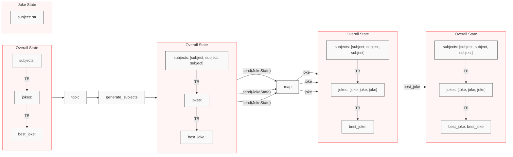

# Send

## 实现能力

1. **动态生成边数量**。可根据自定义情况，动态生成链接到其他节点的边
2. **自定义传入下游的State**。可根据自定义情况，动态生成一份新的State，每个 Send 传入下游的 State 还可以是独立的

```python
from typing_extensions import TypedDict, Annotated
from operator import add
from langgraph.graph import StateGraph, START, END
from langgraph.types import Send
import random

class State(TypedDict):
  list: Annotated[list[str], add]

def random_node(state: State):
  # 随机生成边数量
  value = random.choice([1, 2, 3])
  # 自定义传入的下游 state，并且每条边传入的 state 数据不同
  return [Send("node", { "input": s }) for s in "abc"[:value]]

class SendInput(TypedDict):
  input: str

def node(state: SendInput):
  return {"list": [state["input"]]}

graph = StateGraph(State).add_node(node).add_conditional_edges(START, random_node).add_edge("node", END).compile()

result = graph.invoke({ "list": [] })
print(result)
# {'list': ['a', 'b', 'c']}
# {'list': ['a', 'b']}
```

## Map-Reduce

`Map-Reduce` 操作对于高效的任务分解和并行处理至关重要。这种方法包括将一个任务分解为较小的子任务，并行处理每个子任务，并汇总所有已完成子任务的结果。

考虑以下示例：

- 根据用户提出的一个通用主题，生成一个相关主题列表
- 为每个主题生成一个笑话
- 并从生成的笑话列表中选择最佳笑话。

在这种设计模式中，第一个节点可能会生成一个对象列表（例如，相关主题），并且将所有这些对象（例如，主题）应用于另一个节点（例如，生成笑话）。



```python
import operator
from typing_extensions import Annotated, TypedDict
from my_openai.gpt_4_1_mini import get_gpt_4_1_mini
from langchain_core.prompts import PromptTemplate
from langgraph.types import Send
from langgraph.graph import END, StateGraph, START
from pydantic import BaseModel, Field

llm = get_gpt_4_1_mini()

class Subjects(BaseModel):
  '''笑话主题列表'''
  subjects: list[str] = Field(description="列表中的每个主题都是字符串")

class Joke(BaseModel):
  '''笑话'''
  joke: str = Field(description="笑话内容")

class BestJoke(BaseModel):
  '''最佳笑话下标'''
  index: int = Field(description="笑话的下标，从0开始")

class State(TypedDict):
  # 用户输入的主题
  topic: str
  # 笑话主题列表
  subjects: list[str]
  # 笑话列表
  jokes: Annotated[list, operator.add]
  # 最佳笑话
  best_selected_joke: str

class JokeState(TypedDict):
  subject: str

builder = StateGraph(State)

# 根据用户输入的主题，生成笑话主题列表
def generate_subjects(state: State):
  prompt = PromptTemplate.from_template(template="根据以下关键词: {topic}，生成一个使用逗号分隔的2至5个笑话主题列表").format(topic=state["topic"])
  response = llm.with_structured_output(Subjects).invoke(prompt)
  return { "subjects": response.subjects }

# 根据笑话主题，生成笑话
def generate_joke(state: JokeState):
  prompt = PromptTemplate.from_template(template="根据以下主题: {subject}，生成一个笑话").format(subject=state["subject"])
  response = llm.with_structured_output(Joke).invoke(prompt)
  return { "jokes": [response.joke] }

# 根据笑话主题列表，生成笑话
def continue_to_jokes(state: State):
  return [Send("generate_joke", { "subject": s }) for s in state["subjects"]]

# 根据用户输入的主题，和上面生成的笑话列表，选择最好笑的笑话
def best_joke(state: State):
  jokes = "\n".join(state["jokes"])
  prompt = PromptTemplate.from_template(template="以下是一些关于{topic}的笑话，选择最好笑的一个笑话，返回它的下标。\n\n笑话列表：\n{jokes}").format(topic=state["topic"], jokes=jokes)
  response = llm.with_structured_output(BestJoke).invoke(prompt)
  return { "best_selected_joke": state["jokes"][response.index] }

builder.add_node(generate_subjects)
builder.add_node(generate_joke)
builder.add_node(continue_to_jokes)
builder.add_node(best_joke)
builder.add_edge(START, "generate_subjects")
builder.add_conditional_edges("generate_subjects", continue_to_jokes)
builder.add_edge("generate_joke", "best_joke")
builder.add_edge("best_joke", END)
graph = builder.compile()

for s in graph.stream({ "topic": "动物" }):
  print(s)
```

结果：

```json
{'generate_subjects': {'subjects': ['动物园里的乌龟比赛', '猫咪的午夜冒险', '鹦鹉学舌的糗事']}}

{'generate_joke': {'jokes': ['动物园里举办了一场乌龟比赛，大家都以为比赛会很无聊。结果乌龟们竟然开了个派对，比赛变成了“最慢派对冠军”！']}}
{'generate_joke': {'jokes': ['有个人养了一只鹦鹉，鹦鹉特别喜欢学他说话。一天，他对朋友说：“这鹦鹉真聪明，什么都学。”结果鹦鹉突然大喊：“老板，别忘了给我涨工资！”朋友惊讶地问：“你教它说这话的？”他说：“没有啊，看来它比我还会讨价还价！”']}}
{'generate_joke': {'jokes': ['有一只猫咪决定在午夜去冒险，它偷偷溜出家门，结果被邻居家的狗发现了。狗问："你这是去哪儿？"猫咪得意地说："去参加午夜的猫咪派对！"狗摇摇头说："那你得小心点，别被人类发现了，他们可不喜欢半夜吵闹的派对。"猫咪眨眨眼说："放心，我是专业的夜行者，专门避开人类的视线。"结果第二天早上，猫咪被主人发现睡在沙发上，肚子上还沾着一堆猫粮碎屑。主人笑着说："看来你的午夜冒险就是去厨房偷吃了！"']}}

{'best_joke': {'best_selected_joke': '有个人养了一只鹦鹉，鹦鹉特别喜欢学他说话。一天，他对朋友说：“这鹦鹉真聪明，什么都学。”结果鹦鹉突然大喊：“老板，别忘了给我涨工资！”朋友惊讶地问：“你教它说这话的？”他说：“没有啊，看来它比我还会讨价还价！”'}}
```

