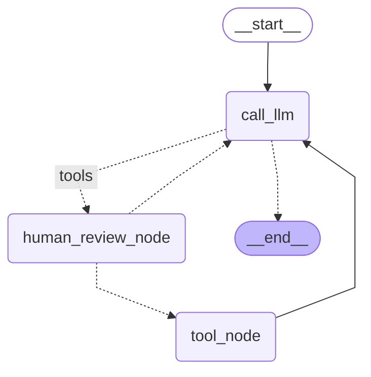

# 人机交互-interrupt

**人在回路 (HIL)** 交互对于`Agent`至关重要。等待人工输入是一种常见的 HIL 交互模式，它允许代理在继续之前向用户提出澄清问题并等待输入。

## `interrupt` 

`interrupt` 允许停止图执行以收集用户的输入，并将收集到的用户反馈，输入`Command(resume=...)`到继续执行

> 停止图执行的前后，需要设置同一个会话id来保存状态

```python
from typing import TypedDict
from langgraph.types import Command, interrupt
from langgraph.checkpoint.memory import MemorySaver
from langgraph.graph import StateGraph, START, END

class State(TypedDict):
  # 用户输入
  user_feedback: str

# 第一步
def before(state: State):
  print("---before---")
  pass

# 第二步
def human_feedback(state: State):
  print("---human_feedback---")
  feedback = interrupt("请输入回调：")
  return { "user_feedback": feedback }

# 第三步
def after(state: State):
  print("---after---")
  print(state['user_feedback'])
  pass

graph = StateGraph(State).add_node(before).add_node(human_feedback).add_node(after).add_edge(START, "before").add_edge("before", "human_feedback").add_edge("human_feedback", "after").add_edge("after", END).compile(checkpointer=MemorySaver())

config = {"configurable": {"thread_id": "1"}}
```

执行第一步，通过 `interrupt` 暂停

```python
for event in graph.stream({}, config):
  print(event)
  print("\n")
```

```
---before---
{'before': None}


---human_feedback---
{'__interrupt__': (Interrupt(value='请输入回调：', resumable=True, ns=['human_feedback:0fced2ae-e6b1-5b8c-ab5e-3ae5f6b2228a']),)}
```

通过代码调用 `Command(resume="hello world!")` 以模拟用户手动输入

```python
for event in graph.stream(
  Command(resume="hello world!"),
  config
):
  print(event)
  print("\n")
```

```
---human_feedback---
{'human_feedback': {'user_feedback': 'hello world!'}}


---after---
hello world!
{'after': None}
```

## 评审工具调用



```python
from typing import Literal
from langchain_core.messages import HumanMessage, AIMessage, ToolMessage
from langchain_core.tools import tool
from my_openai.deepseekv3 import get_deepseek_v3_client
from langgraph.graph import StateGraph, START, END
from langgraph.checkpoint.memory import MemorySaver
from langgraph.prebuilt import ToolNode, tools_condition
from langgraph.types import Command, interrupt

# 模拟一个天气搜索工具
@tool
def search_weather(city: str):
  """搜索一个城市的天气"""
  print(f"---搜索的城市：{city}---")
  return "晴朗"

tools = [search_weather]
# 创建工具节点
tool_node = ToolNode(tools)

model = get_deepseek_v3_client().bind_tools(tools)

def call_llm(state: MessagesState):
  return { "messages": [model.invoke(state["messages"])] }

# 定义用户反馈
def human_review_node(state: MessagesState) -> Command[Literal["call_llm", "tool_node"]]:
  last_message = state["messages"][-1]
  tool_call = last_message.tool_calls[0]

  # 把 AI 调用的工具函数的情况告诉用户，等待用户决定如何处理
  human_review = interrupt(
    {
      "question": "正确吗?",
      "tool_call": tool_call
    }
  )

  # 用户反馈意图
  review_action = human_review["action"]
  # 用户反馈数据（可能存在）
  review_data = human_review.get("data")

  # 如果用户返回同意执行
  if review_action == "continue":
    # 则继续正常往下执行，即把状态给到工具节点
    return Command(goto="tool_node")

  # 如果用户反馈，修改执行的入参
  elif review_action == "update":
    updated_message = AIMessage(
      content=last_message.content,
      tool_calls=[
        {
          "id": tool_call["id"],
          "name": tool_call["name"],
          # 使用用户传入的入参
          "args": review_data
        }
      ],
      id=last_message.id
    )
    return Command(goto="tool_node", update={ "messages": [updated_message] })

  # 用户输入自然语言，反馈给大模型
  elif review_action == "feedback":
    # 为了保证对话消息顺序是正确的，我们这里返回一个工具消息
    tool_message = ToolMessage(
      # 用户反馈消息，作为工具函数的结果
      content=review_data,
      tool_call_id=tool_call["id"],
      name=tool_call["name"]
    )
    return Command(goto="call_llm", update={ "messages": [tool_message] })

builder = StateGraph(MessagesState)
builder.add_node(call_llm).add_node("tool_node", tool_node).add_node(human_review_node)
builder.add_edge(START, "call_llm")
builder.add_conditional_edges(
  "call_llm", 
  tools_condition,
  { "tools": "human_review_node", END: END }
)
builder.add_edge("tool_node", "call_llm")

graph = builder.compile(checkpointer=MemorySaver())
```

#### 不需要用户审查的示例

```python
for event in graph.stream(
  { "messages": HumanMessage(content="你好") },
  {"configurable": {"thread_id": "1"}},
  stream_mode="updates"
):
    print(event)
```

```
{'call_llm': {'messages': [AIMessage(content='你好！有什么可以帮您的吗？', ...]}}
```

#### 允许工具继续往下执行的示例

```python
for event in graph.stream(
  { "messages": HumanMessage(content="今天北京天气如何？") },
  {"configurable": {"thread_id": "2"}},
  stream_mode="updates"
):
    print(event)
    print("\n")
```

```
{'call_llm': {'messages': [AIMessage(content='', additional_kwargs={'tool_calls': [{'id': 'call_0_ec184cb7-b5c7-4ddc-9d59-1d2df2846701', 'function': {'arguments': '{"city":"北京"}', 'name': 'search_weather'}, 'type': 'function', 'index': 0}], 'refusal': None}, ...})]}}

{'__interrupt__': (Interrupt(value={'question': '正确吗?', 'tool_call': {'name': 'search_weather', 'args': {'city': '北京'}, 'id': 'call_0_ec184cb7-b5c7-4ddc-9d59-1d2df2846701', 'type': 'tool_call'}}, resumable=True, ns=['human_review_node:21bb7453-d186-c267-93fc-e512aea2dd90']),)}
```

现在允许工具继续往下执行，不进行编辑

```python
for event in graph.stream(
    Command(resume={"action": "continue"}),
    {"configurable": {"thread_id": "2"}},
    stream_mode="updates",
):
    print(event)
    print("\n")
```

```
{'human_review_node': None}

---搜索的城市：北京---
{'tool_node': {'messages': [ToolMessage(content='晴朗', name='search_weather', id='90ca7260-7494-4d8d-857c-1ca804528898', tool_call_id='call_0_ec184cb7-b5c7-4ddc-9d59-1d2df2846701')]}}

{'call_llm': {'messages': [AIMessage(content='今天北京的天气是晴朗的。', ...)]}}
```

#### 编辑工具调用的示例

如果用户希望修改某些参数，然后在执行工具

```python
for event in graph.stream(
  { "messages": HumanMessage(content="今天北京天气如何？") },
  {"configurable": {"thread_id": "3"}},
  stream_mode="updates"
):
    print(event)
    print("\n")
```

下面用户修改查询的城市

```python
for event in graph.stream(
    Command(resume={"action": "update", "data": {"city": "上海"}}),
    {"configurable": {"thread_id": "3"}},
    stream_mode="updates",
):
    print(event)
    print("\n")
```

```
{'human_review_node': {'messages': [AIMessage(content='', additional_kwargs={}, response_metadata={}, id='run--a4e85624-38a8-4274-bbb0-8aecce7a73a0-0', tool_calls=[{'name': 'search_weather', 'args': {'city': '上海'}, 'id': 'call_0_62d5cb70-a59d-4f15-84ea-1ab8715cb6fb', 'type': 'tool_call'}])]}}

---搜索的城市：上海---
{'tool_node': {'messages': [ToolMessage(content='晴朗', name='search_weather', id='eb040d2b-e276-4fd3-a44a-1b44d90b2011', tool_call_id='call_0_62d5cb70-a59d-4f15-84ea-1ab8715cb6fb')]}}

{'call_llm': {'messages': [AIMessage(content='今天北京的天气是晴朗的。', ...)]}}
```

#### 对工具调用给出自然语言反馈的示例

有时，用户可能不想执行工具调用，用户想自己进行反馈。可以将此反馈作为工具调用的模拟结果插入

```python
for event in graph.stream(
  { "messages": HumanMessage(content="今天北京天气如何？") },
  {"configurable": {"thread_id": "4"}},
  stream_mode="updates"
):
    print(event)
    print("\n")
```

下面模拟用户给出自然语言反馈

```python
for event in graph.stream(
    Command(resume={"action": "feedback", "data": "问错了，我想问上海的天气如何？"}),
    {"configurable": {"thread_id": "4"}},
    stream_mode="updates",
):
    print(event)
    print("\n")
```

```
{'human_review_node': {'messages': [ToolMessage(content='问错了，我想问上海的天气如何？', name='search_weather', id='b6d8af8d-9964-4a08-b75e-01a123644cb1', tool_call_id='call_0_c71f1d65-830d-4419-8a6d-12465676ec98')]}}

{'call_llm': {'messages': [AIMessage(content='', additional_kwargs={'tool_calls': [{'id': 'call_0_30815589-541b-4190-be83-2447f3449a41', 'function': {'arguments': '{"city":"上海"}', 'name': 'search_weather'}, 'type': 'function', 'index': 0}], ...)]}}

{'__interrupt__': (Interrupt(value={'question': '正确吗?', 'tool_call': {'name': 'search_weather', 'args': {'city': '上海'}, 'id': 'call_0_30815589-541b-4190-be83-2447f3449a41', 'type': 'tool_call'}}, resumable=True, ns=['human_review_node:561b170e-b436-0c48-2120-1d860851efa4']),)}
```

可以看到又进行了一次中断，因为进行了新一次工具的调用，下面允许这个并继续执行

````python
for event in graph.stream(
    Command(resume={"action": "continue"}),
    {"configurable": {"thread_id": "4"}},
    stream_mode="updates",
):
    print(event)
    print("\n")
````

```
{'human_review_node': None}

---搜索的城市：上海---
{'tool_node': {'messages': [ToolMessage(content='晴朗', name='search_weather', id='a1aa44c0-c78e-4de3-a623-cc8263f1e702', tool_call_id='call_0_26a5a373-77fe-47f8-ba30-26f163e48b01')]}}

{'call_llm': {'messages': [AIMessage(content='今天上海的天气是晴朗的。', ...)]}}
```

