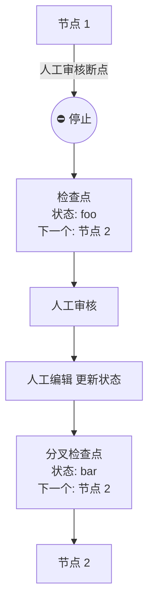
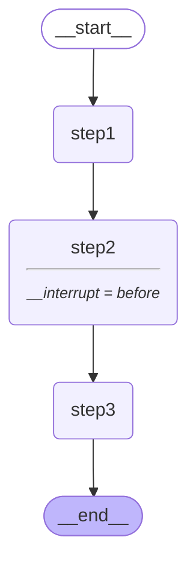

# 人机交互-interrupt_before

## 流程




```python
graph = builder.compile(
  checkpointer=MemorySaver(),
  # 自定义在执行 step2 之前，中断
  interrupt_before=["step2"]
)
```

## interrupt_before




```python
from typing_extensions import TypedDict
from langgraph.graph import StateGraph, START
from langgraph.checkpoint.memory import MemorySaver

class State(TypedDict):
  input: str

def step1(state: State):
  print("step1")
  pass

def step2(state: State):
  print("step2")
  pass

def step3(state: State):
  print("step3")
  pass

builder = StateGraph(State).add_sequence([step1, step2, step3]).add_edge(START, "step1")

graph = builder.compile(
  checkpointer=MemorySaver(),
  # 自定义在执行 step2 之前，中断
  interrupt_before=["step2"]
)

thread = {"configurable": {"thread_id": "1"}}
```

执行断点前的部分

```python
for event in graph.stream({ "input": "hello" }, thread, stream_mode="values"):
  print(event)
```

```
{'input': 'hello'}
step1
```

执行到中断，可以用户自定义根据状态

```python
print(graph.get_state(thread).values) # 可以获取到中断前的状态
graph.update_state(thread, { "input": "world" }) # 可以更新状态
print(graph.get_state(thread).values)
```

```
{'input': 'hello'}
{'input': 'world'}
```

继续往下执行

```python
for event in graph.stream(None, thread, stream_mode="values"):
  print(event)
```

```
step2
step3
```

