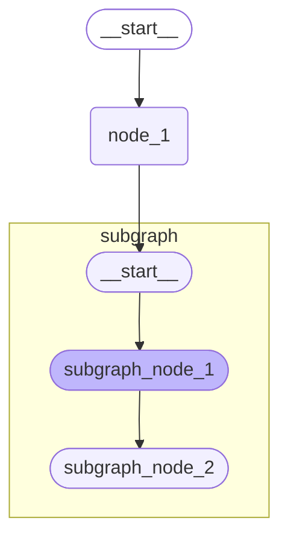

# 子图

子图是一种用于作为另一个图中的节点的图。

## 添加子图

#### 1、将编译后的子图作为节点添加

不需要转换状态（状态是共享的），一般用此方法

```python
builder.add_node("subgraph", subgraph_builder.compile())
```

#### 2、将子图函数的调用放入节点函数中

```python
subgraph = subgraph_builder.compile()

def call_subgraph(state: State):
    return subgraph.invoke({"subgraph_key": state["parent_key"]})

builder.add_node("subgraph", call_subgraph)
```

## 父子通信

#### 1、共享部分状态键

通过共享部分**消息键**进行通信

```python
from langgraph.graph import START, StateGraph
from typing import TypedDict

# 定义子图
class SubgraphState(TypedDict):
    foo: str  # 与父图的共享键
    bar: str

def subgraph_node_1(state: SubgraphState):
    return {"bar": "bar"}

def subgraph_node_2(state: SubgraphState):
    return {"foo": state["foo"] + state["bar"]}

subgraph = (
  StateGraph(SubgraphState)
    .add_sequence([subgraph_node_1, subgraph_node_2])
    .add_edge(START, "subgraph_node_1")
    .compile()
)


# 定义父图
class ParentState(TypedDict):
    foo: str

def node_1(state: ParentState):
    return {"foo": "hi! " + state["foo"]}

graph = (
    StateGraph(ParentState)
    .add_sequence([node_1, subgraph])
    .add_edge(START, "node_1")
    .compile()
)
```



```python
for chunk in graph.stream({"foo": "foo"}, subgraphs=True):
    print(chunk)
```

```
((), {'node_1': {'foo': 'hi! foo'}})
(('LangGraph:a52b97c5-7255-77e2-6269-66452b08c510',), {'subgraph_node_1': {'bar': 'bar'}})
(('LangGraph:a52b97c5-7255-77e2-6269-66452b08c510',), {'subgraph_node_2': {'foo': 'hi! foobar'}})
((), {'LangGraph': {'foo': 'hi! foobar'}})
```

#### 不共享状态

需要定义一个**调用子图的节点函数**

此函数还需要在调用子图之前将输入（父图）状态转换为子图状态，并在返回节点的状态更新之前将结果转换回父图状态。

```python
from langgraph.graph import START, StateGraph
from typing import TypedDict

# 定义子图
class SubgraphState(TypedDict):
    baz: str
    bar: str

def subgraph_node_1(state: SubgraphState):
    return {"baz": "baz"}

def subgraph_node_2(state: SubgraphState):
    return {"bar": state["bar"] + state["baz"]}

subgraph = (
  StateGraph(SubgraphState)
    .add_sequence([subgraph_node_1, subgraph_node_2])
    .add_edge(START, "subgraph_node_1")
    .compile()
)


# 定义父图
class ParentState(TypedDict):
    foo: str

def node_1(state: ParentState):
    return {"foo": "hi! " + state["foo"]}

def node_2(state: ParentState):
  	# 转换为子图状态
    request = { "bar": state["foo"] }
    response = subgraph.invoke(request)
    # 转换为父图状态
    return {"foo": response["bar"]}

graph = (
    StateGraph(ParentState)
    .add_sequence([node_1, node_2])
    .add_edge(START, "node_1")
    .compile()
)

for chunk in graph.stream({"foo": "foo"}, subgraphs=True):
    print(chunk)
```

```python
((), {'node_1': {'foo': 'hi! foo'}})
(('node_2:8a887e62-c1c4-63b6-77b0-797b43c731fb',), {'subgraph_node_1': {'baz': 'baz'}})
(('node_2:8a887e62-c1c4-63b6-77b0-797b43c731fb',), {'subgraph_node_2': {'bar': 'hi! foobaz'}})
((), {'node_2': {'foo': 'hi! foobaz'}})
```

