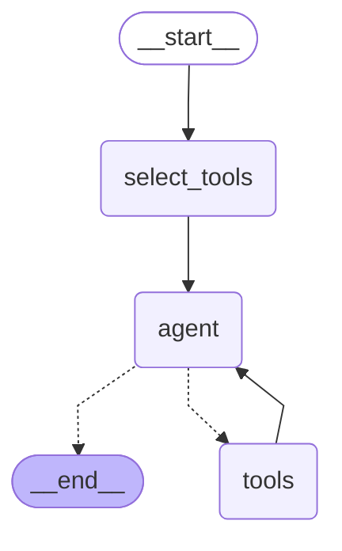

# 大量工具优化

随着可用工具数量的增加，可能会希望限制 LLM 的选择范围，以减少 token 消耗。


批量生成一批工具，给下面示例使用

```python
from langchain_core.tools import StructuredTool
import uuid

animals = {
  "rat": "被视为机警应变，善处逆境，子孙繁衍，家业兴旺的象征。有生生不息，繁盛不衰之吉祥寓意",
  "cattle": "被视为勤奋朴实，诚挚忠厚，忍辱负重，勇武倔强的象征。有勤劳致富，风调雨顺之吉祥寓意",
  "tiger": "被视为威武勇猛，豪爽正义，文彩华美，气宇轩昂的象征。有辟邪降魅，四方安康之吉祥寓意",
  "rabbit": "被视为温柔文静，纯洁高雅，机智灵敏，忠厚善良的象征。有自然超脱，长生不老之吉祥寓意",
  "dragon": "被视为尊贵神圣，志趣高远，能屈能伸，通达旷放的象征。有惩邪镇恶，国泰民安之吉祥寓意"
}

def create_tool(animal: str):
  info = animals[animal]

  def animal_info_tool():
    return f"{animal}的寓意是：{info}"

  return StructuredTool.from_function(
    animal_info_tool,
    name=f"meaning_of_{animal}",
    description=f"关于{animal}的寓意"
  )

tool_registry = {
  str(uuid.uuid4()): create_tool(animal) for animal in animals.keys()
}
```

## 策略一：向量搜索，召回相关工具

1. 向量存储中索引工具描述的嵌入

```python
from langchain_core.documents import Document
from langchain_core.vectorstores import InMemoryVectorStore
from langchain_openai import OpenAIEmbeddings

# 把工具函数的描述作为文档内容向量化
tool_documents = [
    Document(
        page_content=tool.description,
        id=id,
        metadata={"tool_name": tool.name},
    )
    for id, tool in tool_registry.items()
]

vector_store = InMemoryVectorStore(embedding=OpenAIEmbeddings())
vector_store.add_documents(tool_documents)
```

2. 生成一个如下图



```python
from langgraph.graph.message import MessagesState
from my_openai.deepseekv3 import get_deepseek_v3_client
from my_openai.gte_embedding import get_gte_embedding_client
from langgraph.graph import StateGraph, START
from langgraph.prebuilt import ToolNode, tools_condition

class State(MessagesState):
  selected_tools: list[str]

tools = list(tool_registry.values())
llm = get_deepseek_v3_client()

def agent(state: State):
  # 注册相关工具函数
  selected_tools = [tool_registry[id] for id in state["selected_tools"]]
  llm_with_tools = llm.bind_tools(selected_tools)
  return { "messages": [llm_with_tools.invoke(state["messages"])] }

# 更新和用户问题相关的工具函数
def select_tools(state: State):
  query = state["messages"][-1].content
  tool_documents = vector_store.similarity_search(query)
  return { "selected_tools": [document.id for document in tool_documents] }

tool_node = ToolNode(tools=tools)

builder = StateGraph(State).add_node(agent).add_node(select_tools).add_node("tools", tool_node)
builder.add_edge(START, "select_tools")
builder.add_edge("select_tools", "agent")
builder.add_conditional_edges("agent", tools_condition)
builder.add_edge("tools", "agent")

graph = builder.compile()

result = graph.invoke({"messages": [HumanMessage(content="兔的寓意是什么？")]})
for message in result["messages"]:
  message.pretty_print()
```


